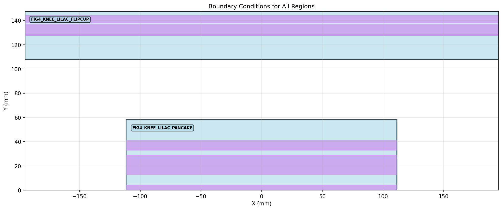

# 🌡️ Figure Thermal Model - Advanced Thermal Analysis Suite

A comprehensive web-based thermal modeling and simulation platform for robotic figure thermal analysis with real-time execution capabilities.



## 🚀 Features

### 🖥️ **Web-Based Thermal Model Editor**
- **Complete JSON Model Management**: Edit thermal models through an intuitive web interface
- **Real-time Validation**: Boundary condition validation with geometric constraints
- **Visual Model Overview**: Dashboard with comprehensive model statistics
- **File Management**: Upload, download, and backup thermal model files

### 🔧 **Advanced Thermal Components**
- **Thermal Regions**: Define complex geometric regions with mesh settings
- **Node Networks**: Create interconnected thermal nodes with custom heat sources
- **Actuators**: Model FETs, motors, and gearbox thermal behavior
- **Boundary Conditions**: Support for multiple BC types:
  - `CONST_Q` - Constant heat flux
  - `CONST_T` - Constant temperature
  - `ADIABATIC` - Insulated boundaries
  - `MAPPED` - Edge-to-edge thermal mapping
  - `NODE_CONNECTED` - Connect to thermal nodes
  - `PLASTIC_COVERED` - Plastic insulation
  - `USERDEF_CONVECTION` - Custom convection
  - `USERDEF_CONDUCTION` - Custom conduction
  - `ACTUATOR_CONNECTED` - Connect to actuator components

### ⚡ **One-Click Simulation Execution**
- **Web-Based Solver**: Execute thermal simulations directly from the browser
- **Real-Time Monitoring**: Live status updates and output streaming
- **Professional Output**: Terminal-style display with real-time progress
- **Automatic Results**: Generate and download result files and plots
- **Background Processing**: Non-blocking execution with progress tracking

### 📊 **Enhanced Temperature Reporting**
- **Node Temperatures**: Direct index-based temperature extraction
- **Actuator Components**: Individual FETs, motor, and gearbox temperatures
- **Boundary Analysis**: Average temperatures for each boundary condition type
- **Thermal Networks**: Complete thermal resistance and heat flow analysis
- **Statistical Summary**: Min/max/average temperatures with duration tracking

### 🎨 **Modern User Interface**
- **Responsive Design**: Works on desktop and mobile devices
- **Dark Theme**: Professional dark UI with excellent contrast
- **Real-Time Updates**: AJAX-powered live data refresh
- **Intuitive Navigation**: Clear menu structure and breadcrumbs
- **Visual Feedback**: Status indicators, progress bars, and notifications

## 🛠️ Installation & Setup

### Prerequisites
```bash
# Python 3.8+
python --version

# Required packages
pip install flask matplotlib numpy scipy
```

### Quick Start
```bash
# Clone the repository
git clone https://github.com/Mengero/Figure_ThermalModel.git
cd Figure_ThermalModel

# Start the web interface
python thermal_json_editor.py

# Open your browser to
http://localhost:5000
```

## 📖 Usage Guide

### 1. **Load or Create Thermal Model**
- **Load Default**: Click "Load Default (GEO.json)" on the file manager
- **Upload File**: Upload your own thermal model JSON file
- **Create New**: Start with a template and build your model

### 2. **Configure Thermal Model**
- **Environment Settings**: Set ambient temperature, heat transfer coefficients
- **Add Regions**: Define thermal regions with geometry and material properties
- **Create Node Networks**: Build thermal node connections
- **Add Actuators**: Configure FETs, motors, and gearbox thermal models
- **Set Boundary Conditions**: Apply thermal boundary conditions to regions

### 3. **Run Simulation**
- **One-Click Execution**: Click "Run Simulation" from the dashboard
- **Monitor Progress**: Watch real-time output and status updates
- **View Results**: Download result files and temperature distribution plots
- **Analyze Data**: Review comprehensive temperature reports

## 🏗️ Architecture

### Core Components
```
📁 Project Structure
├── 🖥️ thermal_json_editor.py      # Main Flask web application
├── 📁 header_files/               # Core thermal solver modules
│   ├── arm_main_solver.py         # Main simulation entry point
│   ├── arm_solver_utils.py        # Enhanced solver utilities
│   ├── thermal_parameters.py      # Parameter management
│   ├── thermal_analysis.py        # Analysis algorithms
│   └── boundary_conditions.py     # Boundary condition handling
├── 📁 templates/                  # Web interface templates
├── 📁 static/                     # Static assets and images
└── 📄 GEO.json                   # Default thermal model
```

### Data Flow


## 🔬 Technical Specifications

### Solver Capabilities
- **Multi-Physics**: Coupled thermal-mechanical analysis
- **Advanced Meshing**: Adaptive mesh generation
- **Boundary Conditions**: 8+ boundary condition types
- **Material Models**: Temperature-dependent properties
- **Convergence Control**: Adaptive solver parameters

### Performance Features
- **Background Processing**: Non-blocking web interface
- **Memory Optimization**: Efficient sparse matrix operations
- **Real-Time Updates**: Live simulation monitoring
- **Error Handling**: Comprehensive error reporting and recovery

## 📈 Example Results

### Temperature Distribution
The solver generates detailed temperature maps showing:
- **Spatial Distribution**: 2D/3D temperature contours
- **Thermal Gradients**: Heat flow visualization
- **Hot Spots**: Critical temperature regions
- **Component Analysis**: Individual part temperatures

### Comprehensive Reports
```
Node Network Temperature Results:
Network: test_nodes
  Node 'node1': 48.50°C (Heat: 1.0 W)
  Node 'node2': 47.50°C (Heat: 1.5 W)
  Connections: node1 → node2 (1.0 K/W), node2 → air (3.0 K/W)

Boundary Condition Temperatures:
  NODE_CONNECTED Boundary: Avg 48.75°C (25 elements)
```

## 🔧 Configuration

### Environment Settings
```json
{
  "environment": {
    "ambient_temperature": 40.0,
    "heat_transfer_coefficient": 15,
    "plastic_conductivity": 0.25
  }
}
```

### Node Network Example
```json
{
  "node_networks": [{
    "id": "thermal_nodes",
    "nodes": [
      {
        "id": "node1",
        "thermal_capacity": 0.0,
        "heat_source": 1.0
      }
    ],
    "connections": [
      {
        "from_node": "node1",
        "to_node": "air",
        "thermal_resistance": 2.0
      }
    ]
  }]
}
```

## 🚀 Advanced Features

### Real-Time Simulation
- **Live Output Streaming**: Watch solver progress in real-time
- **Status Monitoring**: Track simulation phases and completion
- **Background Execution**: Continue using interface while solving
- **Automatic Results**: Download links appear on completion

### Enhanced Temperature Analysis
- **Multi-Level Reporting**: Region, node, actuator, and boundary temperatures
- **Statistical Analysis**: Min/max/average with standard deviations
- **Thermal Network Analysis**: Heat flow and resistance calculations
- **Visual Results**: Automatic plot generation and display

## 📝 API Reference

### Simulation Control
- `POST /run_simulation` - Start thermal simulation
- `GET /simulation_status` - Get current simulation status
- `GET /simulation_output` - Get real-time output
- `GET /download_simulation_results` - Download results file

### Model Management
- `GET /dashboard` - Main model overview
- `POST /region/add` - Add new thermal region
- `POST /actuator/add` - Add new actuator
- `POST /node_network/add` - Add new node network

## 🤝 Contributing

We welcome contributions! Please see our guidelines:
1. Fork the repository
2. Create a feature branch
3. Make your changes
4. Add tests if applicable
5. Submit a pull request

## 📄 License

This project is licensed under the MIT License - see the LICENSE file for details.

## 🙋‍♂️ Support

For questions, issues, or feature requests:
- **GitHub Issues**: [Report issues](https://github.com/Mengero/Figure_ThermalModel/issues)
- **Documentation**: Check the `/templates` folder for UI examples
- **Examples**: See `GEO.json` for model structure

## 🔄 Version History

### v0.3-finalized (Current)
- ✅ Web-based simulation execution
- ✅ Real-time status monitoring
- ✅ Enhanced temperature reporting
- ✅ Node resistance model improvements
- ✅ Professional UI/UX

### v0.2
- Basic thermal model structure
- Command-line solver

### v0.1
- Initial thermal analysis framework

---

**Built with ❤️ for advanced thermal analysis**

*Transform your thermal modeling workflow with our comprehensive web-based platform.*
